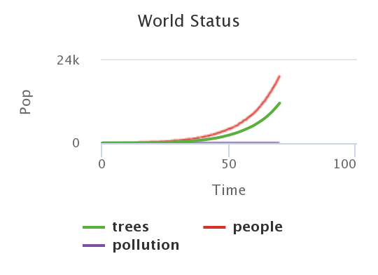
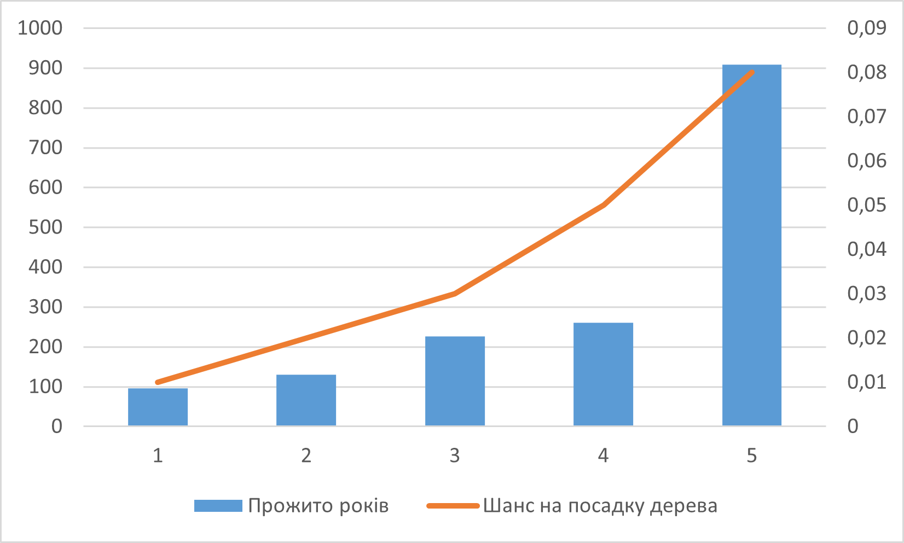
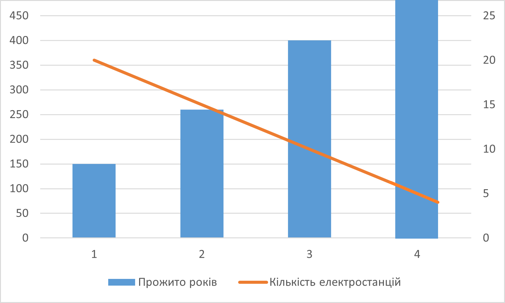

# lab1
# СПм-22-6, Бохан Іван Анатолійович
### Лабораторна робота №**1**. Опис імітаційних моделей та проведення обчислювальних експериментів

 

### Варіант 4, модель у середовищі NetLogo:
[Urban Suite - Pollution](http://www.netlogoweb.org/launch#http://www.netlogoweb.org/assets/modelslib/Curricular%20Models/Urban%20Suite/Urban%20Suite%20-%20Pollution.nlogo)

 

### Вербальний опис моделі:
Для виконання завдання 1 лабораторної роботи я використовую модель Urban Suite - Pollution. Ця модель є дослідженням крихкої рівноваги екосистеми хижак-жертва. Популяції людей, елементів ландшафту та зграї повітряних забруднювачів конкурують за ресурси в замкнутому середовищі. Використовуючи цю модель, можна досліджувати поведінку популяцій протягом тривалого часу, коли вони динамічно взаємодіють: хижаків (забруднення) і здобич (людей) можна порівнювати протягом кількох поколінь, оскільки їхні популяції демонструють регулярний або нерегулярний репродуктивний успіх.
Регулярні коливання (цикли) чисельності популяції вказують на баланс і стабільність в екосистемі, де, незважаючи на коливання, популяції зберігаються протягом тривалого часу. І навпаки, нерегулярні коливання вказують на нестабільність, що веде до потенційного вимирання обох співзалежних популяцій. Модель встановлює негативну петлю зворотного зв’язку: хижаки гальмують щільність здобичі, а здобич стимулює щільність хижаків.
### Як працює модель:
Електростанції створюють забруднення, яке поширюється в навколишнє середовище. Здоров’я людей, які піддаються впливу цього забруднення, негативно впливає, зменшуючи їхні шанси на відтворення. Ті, хто здатні відтворювати потомство, створять здорових дітей при певній народжуваності. Люди також можуть вжити певних дій, щоб полегшити проблему забруднення, яка представлена в цій моделі шляхом висаджування дерев. Наявність дерев допомагає стримувати забруднення.

Навіть без забруднення здоров’я людей з часом погіршується, і вони врешті-решт помруть природною смертю. Щоб дозволити популяціям людей вистояти, людей клонують з певною швидкістю (див. повзунок НАРОДЖУВАННЯ). Стабільність екосистеми досягається, якщо рівні забруднюючих речовин утримуються під контролем, і ні популяції людей, ні елементи ландшафту не обганяють навколишнє середовище. Як і в будь-якому моделюванні на основі агентів, правила визначають поведінку кожного окремого агента в кожній сукупності.

### Параметри Setup:
- **initial-population** - контролює кількість людей, створених на початку запуску моделі.
- **power-plants** - контролює кількість створених на старті симуляції електростанцій.
- **polluting-rate** - це забруднення, яке виробляє кожна електростанція за рік. Потім це забруднення поширюється на навколишню територію.

### Параметри, що можуть надавати вплив під час роботи симуляції:
- **birth-rate** - контролює можливість кожної людини народити потомство. Початкова ставка 0,10 означає, що кожен рік вони мають 10% шансів мати дитину, якщо вони достатньо здорові. Люди повинні мати 4 бали здоров'я або більше, щоб відтворювати потомство, і вони втрачають 0,1 бали щороку. Це означає, що вони мають щонайбільше 10 років для розмноження, і навіть менше, якщо вони постраждали від забруднення. Параметр за замовчуванням дуже близький до "коефіцієнта заміщення", що означає, що в середньому кожна людина має одне потомство.
- **planting-rate** - контролює зміну, яку людина має висаджувати дерево щороку. Значення за замовчуванням 0,05 означає, що вони мають 5% шанс. Дерева живуть 50 років і ніколи не розмножуються. У цьому сенсі вони не є буквально деревами, а представляють будь-який механізм очищення забруднення.

### Показники роботи системи:
- count people - поточна кількість людей.
- World Status - графік показує, скільки там дерев, скільки людей і скільки забруднень, що відображається в часі під час роботи моделі.

### Примітки:
1) Іноді кількість дерев настільки зменшує забруднення, що кількість людей збільшується.
2) З налаштуванням за замовчуванням популяції з часом вимирають, але час, протягом якого вони виживають, дуже різниться.
3) У реальному житті для роботи електростанції бажана присутність людини. У цій моделі ця умова відсутня.

### Недоліки моделі:
1) Для появи нащадку немає жодних умов(кількість батьків, стать батьків, тощо).
2) Розташування та групування електростанцій не впливають на потужність забруднення.
 

## Обчислювальні експерименти
 
### 1. Вплив залежності швидкості посадки дерев від показника народжуємості 
Досліджується залежність trees count від birth-rate.
Експерименти проводяться при таких налаштуваннях:
- **initial population** 30
- **planting-rate** 0,05
- **power-plants** 3
- **polluting-rate** 1

<table>
<thead>
<tr><th>Кількість дерев через 200 років</th><th>Максимальна кількість одночасно посажених дерев</th><th>birth-rate</th></tr>
</thead>
<tbody>
<tr><td>66 (у 67 року всі померли)</td><td>65</td><td>0,02</td></tr>
<tr><td>34 (у 92 року всі померли)</td><td>92</td><td>0,05</td></tr>
<tr><td>32 (у 137 року всі померли)</td><td>136</td><td>0,08</td></tr>
<tr><td>180</td><td>180</td><td>0,1</td></tr>
<tr><td>11589 (система не впоралася з навантаженням, кількість населення у 70 року - 19626)</td><td>11589</td><td>0,15</td></tr>
</tbody>
</table>

Графік наочно показує, що ніж більше рівень народжуємості тим більше дерев висаджується кожен тік(рік). Було спостережено, що при birth-rate ≥ 0,1 виникає велике навантаження на систему, а також популяція буде жити "нескінченно".

### 2. Вплив шансу на посадку дерева на кількість прожитих років
Досліджується показник years в залежності від planting-rate.
Експерименти проводяться при таких параметрах:
- **initial-population** 30
- **birth-rate** 0,09
- **power-plants** 3
- **polluting-rate** 1

<table>
<thead>
<tr><th>Прожито років</th><th>Шанс на посадку дерева</th></tr>
</thead>
<tbody>
<tr><td>96</td><td>0,01</td></tr>
<tr><td>130</td><td>0,02</td></tr>
<tr><td>226</td><td>0,03</td></tr>
<tr><td>260</td><td>0,05</td></tr>
<tr><td>909</td><td>0,08</td></tr>
</tbody>
</table>

Дивлячись на графік можна помітити, що ніж більше дерев буде посаджено людьмми тим більше років буде жити популяція.

### 3. Вплив кількості електростанцій на кількість прожитих років
Досліджуються параметри power-plants та years.
Експерименти проводяться при таких параметрах:
- **initial-population** 30
- **birth-rate** 0,1
- **planting-rate** 0,05
- **pollution-rate** 3

<table>
<thead>
<tr><th>Прожито років</th><th>Кількість електростанцій</th></tr>
</thead>
<tbody>
<tr><td>150</td><td>20</td></tr>
<tr><td>260</td><td>15</td></tr>
<tr><td>400</td><td>10</td></tr>
<tr><td>Нескінченно</td><td>5</td></tr>
</tbody>
</table>

Впродовж цього експерименту було помічено, що на кількість прожитих років впливає не тільки кількість електростанцій, але й ще їх положення. У зв'язку з цим у таблицю були внесені усереднені значення.
